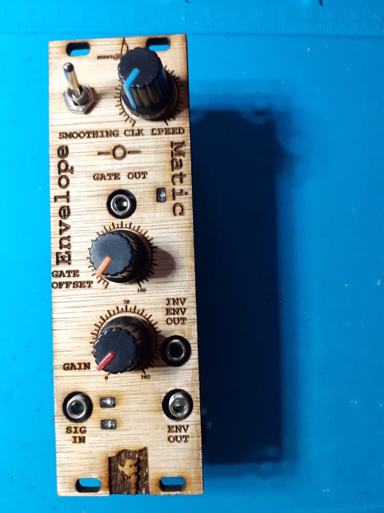

Bissell-Bouten-Envelope-O-Matic aka Follow-O-Matic is an envelope follower.

This is my take on a designed published by Harry Bissel on Modwiggler (Harry Bissell's Fast Response Low Ripple Envelope Follower - MUFF WIGGLER 3). When fed with an input signal it outputs a signal which closely follows the contours of the input signal’s amplitude. Its workings are based on rectifying the input signal, detection of its peak values which are captured by a sample and hold mechanisme and finally some smoothing to gradually change the output signal over time.

I simplified the design quite a bit without compromising the original idea. I added controls to change the S&H frequency and smoothing. Furthermore I added a gate circuit i.e. a comparator linked to the output signal which generates gate signals depending on a variable threshold.

To add some bling to the circuit in stead of diodes in the full rectifier I used some LEDs which are visible from the front panel. The gate open/close is also signaled by an LED.

You can find a short video demonstrating the envelope follower here: https://www.youtube.com/watch?v=u97sy82oXKw

After my first publication of a hand drawn schematic on the lookmumnocomputer discourse server (have a look here: https://lookmumnocomputer.discourse.group/t/envelope-o-matic-v0-2-aka-follow-o-matic/3171) one of its members TimMJN reached out and asked for a PCB design.  To accomodate both my interest in using the envelope follower in a eurorack setup and Tim's desire to use it in a KOSMO setup, I split the circuit into 2 parts to make this possible.  The PCB design consists of a PCB containing the main circuitry and a second PCB containing the controls and IO-jacks. Using pin headers and connectors they can be connected together. In the gerber folder you will find the designs for a euro rack setup. TimMJN has designed a front panel PCB for KOSMO, the details of which you can find on his github: https://github.com/TimMJN/Bissell-Bouten-Envelope-o-Matic-Kosmo
